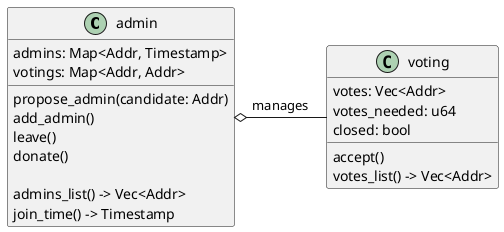
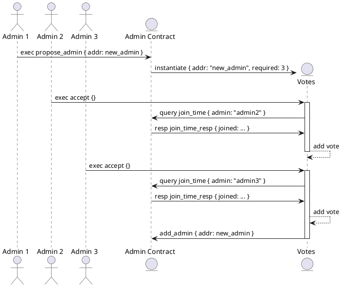
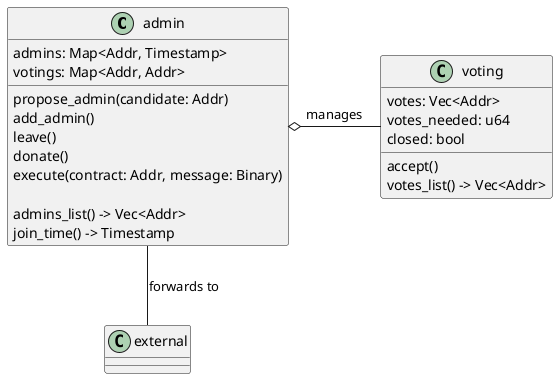
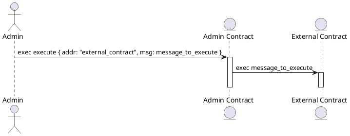

# Design

It's time to start discussing the design of our system. Building multi-contract systems tends to
be a bit more complicated than just isolated contracts, so its useful to have some kind of anchor first, which is the purpose of this chapter. If you feel lost with the design, don't worry - it will become clearer when we are actually implementing the contracts. For now, let's go through it once to get a general idea.

First, let's think about the problem we want to solve. Our admins are a vector of addresses. Anyone who is already
an admin can add anyone they wish to the list. But this "anyone" can be a second instance of the same admin
account, meaning that they would be counted twice for donations!

This issue is relatively simple to fix, but there is another problem - as we already learned, the admin could
create a smart contract which he and only he can withdraw tokens from and register it as another admin in the
group! Instantiating it multiple times, he can achieve his goal even if we prevent adding the same address
multiple times. There would be many distinct addresses that the same person owns.

It looks like an unpleasant situation, but there are ways to manage it. The one we will implement is voting.
Instead of being able to add another admin to the list unilateraly, admins will be allowed to propose new admins. This would kickstart a voting process and all admins at the time of the proposal creation
would be able to choose to support it. If more than half of the admins support the new candidate, then they immediately
become an admin.

It is not the most sophisticated voting process, but it will be enough for our demonstration purposes.

## Voting process

To achieve this goal we will create two smart contracts. For the first one we will re-use the contract from the
[Basics](../basics.md) chapter. This will be our `admin` contract. We also need to add a `voting` contract.
It will be responsible for managing a single voting process. It will be instantiated by an `admin` contract
whenever an admin wants to add a colleague to the list. Here is a diagram showing the relationship of the contracts:

Here is the flowchart for adding an admin. We assume there are 5 admins on the contract to start with, but 2 of them don't do anything:

We already gave some hints about how the contracts could be implemented, but we won't go into that just yet.

## Message forwarding

There is one other thing we want to add: some way to assign the admins some work. The `admin` contract will behave like
a proxy to call another contract. That means that some other external contract would just set our `admin` instance
as a specific address that can perform executions on it, and admins would perform actions this way. The external
contract would see execution messages sent by the admin contract. Here is an updated contracts diagram:

And calling external contract flowchart:

Note that the `msg` on `execute` admin contract message is some arbitrary message just forwarded
to the external contract. It would be a base64-encoded message in the real world, but this is
just an implementation detail.

Ultimately we will create a simple example of an external contract to understand how to use such a pattern.
