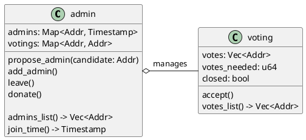
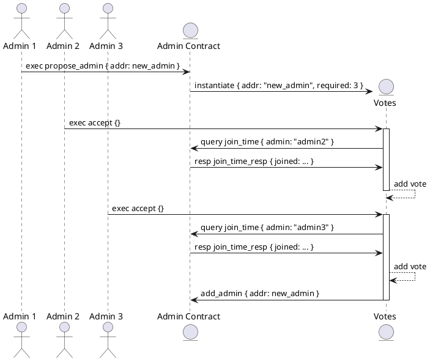
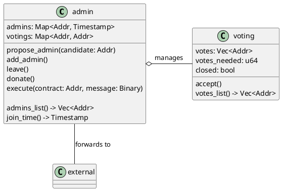
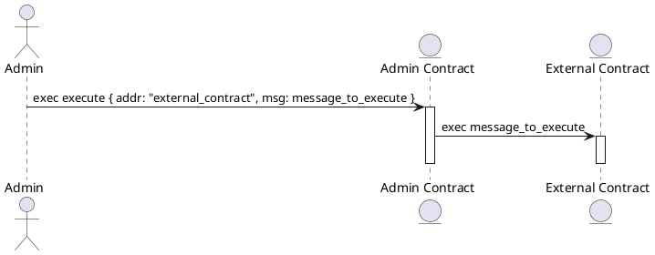

# Design

This time we will start discussing the design of our system a bit. Building multi-contract systems tend to
be a bit more complicated than just isolated contracts, so I want to give you some anchor on what we are
building in this chapter. If you feel lost with a design, don't worry - it will get clear while implementing
contracts. For now, go through it to get a general idea.

First, let's think about the problem we want to solve. Our admins are a vector of addresses. Anyone already
an admin can add anyone he wants to the list. But this "anyone" can be a second instance of the same admin
account, so he counts twice for donations!

This issue is relatively simple to fix, but there is another problem - as we already learned, the admin could
create a smart contract which he and only he can withdraw tokens from and register as another admin in the
group! Instantiating it multiple times, he can achieve his goal even if we prevent adding the same address
multiple times. There would be many distinct addresses that the same person owns.

It looks like an unpleasant situation, but there are ways to manage it. The one we would implement is voting.
Instead of being able to add another admin to the list, admins would be allowed to propose their colleagues
as new admins. It would start a voting process - everyone who was an admin at the time of the proposal creation
would be able to support it. If more than half admins would support the new candidate, he would immediately
become an admin.

It is not the most convoluted voting process, but it would be enough for our purposes.

## Voting process

To achieve this goal, we would create two smart contracts. First, one would be reused contract from the
[Basics](../basics.md) chapter - it would be an `admin` contract. Additionally, we would add a `voting` contract.
It would be responsible for managing a single voting process. It would be instantiated by an `admin` contract
whenever an admin wants to add his friend to a list. Here is a diagram of the contracts relationship:

Here is adding an admin flowchart - assuming there are 5 admins on the contract already, but 2 of them did nothing:

I already put some hints about contracts implementation, but I will not go into them yet.

## Messages forwarding

There is one other thing we want to add - some way to give admins work. The `admin` contract would behave like
a proxy to call another contract. That means that some other external contract would just set our `admin` instance
as a specific address that can perform executions on it, and admins would perform actions this way. The external
contract would see execution as the admin contract would do it. Here is an updated contracts diagram:

And calling external contract flowchart:

Note that the `msg` on `execute` admin contract message is some arbitrary message just forwarded
to the external contract. It would be a base64-encoded message in the real world, but it is
just an implementation detail.

Ultimately, we will create a simple example of an external contract to understand how to use such a pattern.
