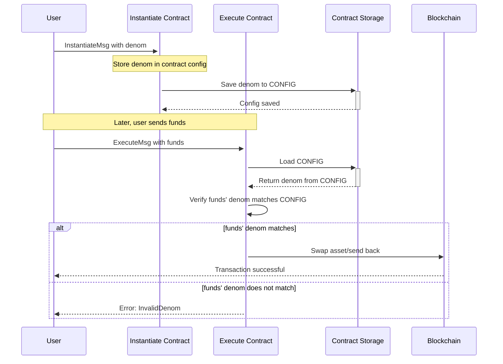
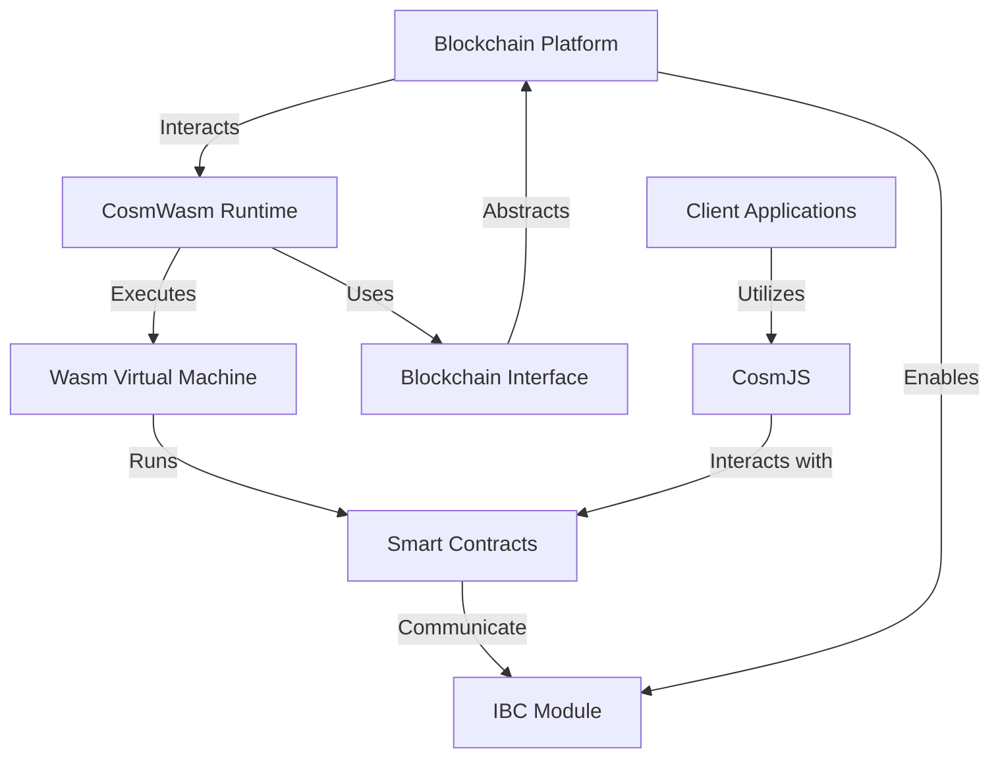
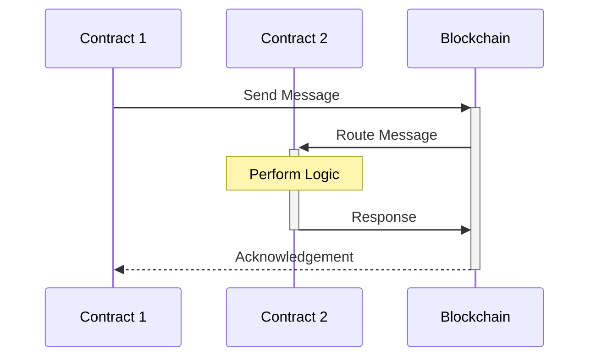

# Basic Concepts of CosmWasm

## Understanding Smart Contracts

In the evolving landscape of blockchain technology, smart contracts emerge as a cornerstone, automating the execution of agreements without the need for intermediaries. These digital contracts store, verify, and enforce the negotiation or performance of an agreement or transaction. This section delves into the intrinsic properties of smart contracts and elucidates the significant enhancements introduced by CosmWasm, a pioneering framework that amplifies their potential within the blockchain ecosystem.

## The Quintessence of Smart Contracts: Self-Executing and Immutable

Smart contracts are fundamentally characterized by their self-executing and immutable nature. They are programs that automatically execute the terms of a contract upon the fulfillment of specified conditions. This automation not only streamlines processes but also instills a level of trust and reliability previously unattainable in digital agreements. Once deployed on a blockchain, these contracts are immutable, a trait ensuring that their logic cannot be altered or tampered with, further cementing their role as a trust mechanism in digital transactions.

## CosmWasm's Contributions to Smart Contract Evolution

CosmWasm extends the functionality of smart contracts through three pivotal enhancements: interoperability, developer accessibility, and scalability.

- **Interoperability**: CosmWasm's architecture is ingeniously designed to facilitate smart contracts' deployment across diverse blockchain platforms within the Cosmos ecosystem. This cross-chain compatibility heralds a new era of decentralized applications (dApps) that leverage the unique strengths of multiple blockchains, fostering a more integrated and versatile blockchain landscape.

- **Developer Accessibility**: By harnessing the power and safety of Rust, CosmWasm lowers the barrier to entry for smart contract development. Rust's stringent compile-time checks and emphasis on memory safety drastically reduce common security vulnerabilities, making the development process both more secure and accessible.

- **Scalability**: Addressing one of the most pressing challenges in blockchain development, CosmWasm ensures that smart contracts can effectively scale to accommodate increasing demand. This is achieved through optimized performance and efficient state management, ensuring that dApps built on CosmWasm can serve expansive user bases without compromising on speed or functionality.

## Synthesis: The Impact of CosmWasm on Smart Contracts

Through its innovative enhancements, CosmWasm redefines the possibilities of smart contracts, making them more adaptable, secure, and user-friendly. By addressing key challenges such as interoperability, security, and scalability, CosmWasm not only broadens the applicability of smart contracts but also paves the way for their increased adoption in solving complex real-world problems. As we venture further into the CosmWasm ecosystem, the profound impact of these advancements on the development of decentralized applications becomes increasingly evident, marking a significant evolution in the blockchain domain.

### Enhancements by CosmWasm

CosmWasm enhances traditional smart contract capabilities, focusing on:

- **Compatibility**: Facilitates deployment across various blockchain platforms.
- **Scalability**: Ensures contracts can handle increasing workloads effectively.

```rust
// Example Rust Code for CosmWasm's Compatibility
const CONFIG: Item<Config> = Item::new("config");

#[entry_point]
pub fn instantiate(deps: DepsMut, _env: Env, info: MessageInfo, msg: InstantiateMsg) -> StdResult<Response> {
    let config = Config {
        // we store the denomination we want to handle in the contract, e.g. "ujuno", "ukuji", etc.
        // this allows us to upload the same contract to multiple chains and handle their native
        // denominations by instantiating it with the correct one
        denom: msg.denom,
    };
}


#[entry_point]
pub fn execute(deps: DepsMut, _env: Env, info: MessageInfo, msg: ExecuteMsg) -> StdResult<Response> {
    // we want exactly one denomination to be sent to this contract
    if info.funds.len() != 1 {
        return Err(ContractError::NeedExactlyOneAsset {})?;
    }
    let coin = &info.funds[0];
    let config = CONFIG.load(deps.storage)?;

    // we only accept the configured denomination
    if coin.denom != config.denom {
        return Err(ContractError::InvalidDenom {
            expected: config.denom,
            received: coin.denom,
        })?;
    }

    // Execute logic, e.g., swapping the coin for another asset and sending that back
}
```


## CosmWasm Architecture Overview

CosmWasm's architecture is built on several key components that work together to provide a seamless environment for deploying and executing smart contracts on various blockchain platforms. These components include:

- **Wasm Virtual Machine (VM):** At the core of CosmWasm is a WebAssembly (Wasm) VM that allows smart contracts to be written in Rust (or other supported languages) and compiled to Wasm bytecode. This VM provides an execution environment that is both secure and isolated from the blockchain's native execution environment.

- **CosmWasm Runtime:** This is a layer that interfaces between the blockchain (such as Cosmos SDK-based chains) and the Wasm VM. It handles the instantiation of contracts, dispatches messages to them, and manages state persistence. The runtime also deals with contract upgrades, migrations, and query handling.

- **Smart Contracts:** These are self-contained programs written by developers to implement business logic. They are deployed on the blockchain and executed within the Wasm VM. Contracts can communicate with each other and with the blockchain through the CosmWasm runtime.

- **Blockchain Interface:**CosmWasm abstracts blockchain-specific functionalities through a set of interfaces. These interfaces allow the CosmWasm runtime to interact with blockchain features like token transfers, account management, and consensus mechanisms without being tied to a specific implementation.

- **IBC Module:** For blockchains built with the Cosmos SDK, CosmWasm integrates with the Inter-Blockchain Communication (IBC) protocol to enable cross-chain interactions. The IBC module in CosmWasm facilitates the sending and receiving of messages and assets across different blockchain networks.

- **CosmJS:** This is a JavaScript library that developers can use to interact with CosmWasm contracts from client-side applications. It provides functionalities for querying contract states, executing contract functions, and listening to contract events.

Below is a Mermaid diagram that visualizes the CosmWasm architecture:


This diagram highlights the modular design of CosmWasm, showcasing how each component plays a crucial role in the ecosystem. The separation between the blockchain platform and the Wasm VM through the CosmWasm runtime ensures flexibility and compatibility across different blockchains. The inclusion of the IBC module underscores CosmWasm's commitment to interoperability, a key aspect of modern blockchain architectures.

In summary, CosmWasm's architecture is thoughtfully designed to foster a secure, interoperable, and developer-friendly environment for smart contract development across the blockchain spectrum. Its modular components and integration with Cosmos SDK and IBC protocol make it a powerful tool for building the next generation of decentralized applications.

## Key Components

Contract Lifecycle: Manages deployment, execution, and termination of contracts.
Query and Execute Functions: Facilitate reading data and making state changes in the blockchain.

```rust
// Example Rust Code for Query and Execute Functions
#[entry_point]
pub fn query(deps: Deps, _env: Env, msg: QueryMsg) -> StdResult<Binary> {
    // Query logic, e.g., fetching contract state
}

#[entry_point]
pub fn execute(deps: DepsMut, _env: Env, info: MessageInfo, msg: ExecuteMsg) -> StdResult<Response> {
    // Execute logic, e.g., updating state, sending funds
}
```

Communication Flow: Ensures effective communication within and between contracts in the CosmWasm ecosystem.

```rust
// Example Rust Code for Communication in CosmWasm
#[entry_point]
pub fn execute(deps: DepsMut, _env: Env, info: MessageInfo, msg: ExecuteMsg) -> StdResult<Response> {
    let res = Response::new()
        // Adding attributes to the response, which can be seen as 'events'
        .add_attribute("action", "execute")
        .add_attribute("sender", info.sender.to_string());
    // Additional logic for inter-contract communication here
    Ok(res)
}
```

Effective communication in the CosmWasm ecosystem is crucial for the seamless operation and interoperability of decentralized applications. This section delves into the significance of communication between contracts and the blockchain, highlighting the pivotal role of the `Response` object in signaling execution results and facilitating event-driven interactions. By ensuring a robust communication framework, CosmWasm enhances the functionality and reliability of smart contracts, making them more adaptable and efficient in the ever-evolving landscape of blockchain technology.

CosmWasm's architecture, focusing on interoperability, security, and ease of use, makes it an ideal framework for building robust and scalable decentralized applications.
