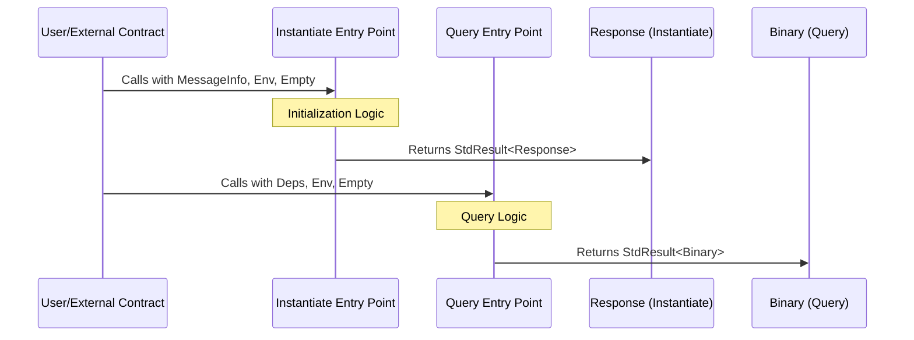

# Entry Points
Unlike traditional Rust applications that start with a `main()` function, smart contracts have several entry points corresponding to different message types, such as instantiate, execute, and query. These entry points allow the contract to interact with the blockchain in various ways.

To define these entry points, use the #[entry_point] macro from CosmWasm. Here's an example for the instantiate and query entry points:
```rust
use cosmwasm_std::{entry_point, Deps, DepsMut, Env, MessageInfo, Response, StdResult, Binary, Empty};

#[entry_point]
pub fn instantiate(
    deps: DepsMut,
    env: Env,
    info: MessageInfo,
    msg: Empty,
) -> StdResult<Response> {
    // Initialization logic here
    Ok(Response::new())
}

#[entry_point]
pub fn query(
    deps: Deps,
    env: Env,
    msg: Empty,
) -> StdResult<Binary> {
    // Query logic here
    Ok(Binary::from("Hello, World!"))
}
```


This diagram starts with the user or an external contract making a call to either the `instantiate` or `query` entry points, providing the necessary data (`MessageInfo`, `Env`, `Empty`). The `instantiate` function processes the initialization logic and returns a `StdResult<Response>`, indicating the outcome of the initialization. Similarly, the query function processes the incoming `query` and returns a `StdResult<Binary>`, encapsulating the query's response data.

## Creating a Query
To enhance the contract's functionality, add a query operation allowing users to request data. This involves using the serde crate for data serialization and defining a query message type and response: