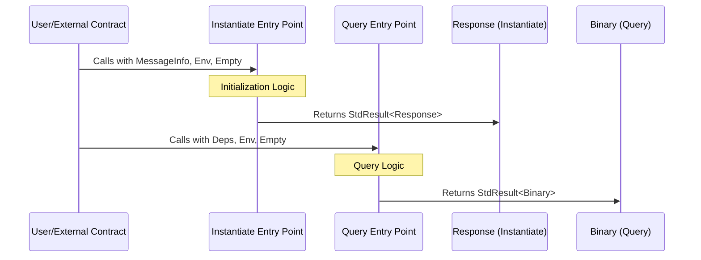

# Entry Points
Unlike traditional Rust applications that start with a `main()` function, smart contracts have several entry points corresponding to different message types, such as instantiate, execute, and query. These entry points allow the contract to interact with the blockchain in various ways.

To define these entry points, use the #[entry_point] macro from CosmWasm. Here's an example for the instantiate and query entry points:
```rust
use cosmwasm_std::{entry_point, Deps, DepsMut, Env, MessageInfo, Response, StdResult, Binary, Empty};

#[entry_point]
pub fn instantiate(
    deps: DepsMut,
    env: Env,
    info: MessageInfo,
    msg: Empty,
) -> StdResult<Response> {
    // Initialization logic here
    Ok(Response::new())
}

#[entry_point]
pub fn query(
    deps: Deps,
    env: Env,
    msg: Empty,
) -> StdResult<Binary> {
    // Query logic here
    Ok(Binary::from("Hello, World!"))
}
```


This diagram starts with the user or an external contract making a call to either the `instantiate` or `query` entry points, providing the necessary data (`MessageInfo`, `Env`, `Empty`). The `instantiate` function processes the initialization logic and returns a `StdResult<Response>`, indicating the outcome of the initialization. Similarly, the query function processes the incoming `query` and returns a `StdResult<Binary>`, encapsulating the query's response data.

## Creating a Custom Query
After setting up the basic structure and understanding entry points, the next step is to enrich the smart contract with the ability to respond to specific queries. This requires defining a query message type and corresponding handler within the contract.

## Define the Query Message Type
First, define the types of queries your contract should respond to. This involves creating enums or structs that represent different query requests. Here's an example using `serde` for serialization:
```rust
use serde::{Serialize, Deserialize};

#[derive(Serialize, Deserialize, Clone, PartialEq, Debug)]
pub enum QueryMsg {
    // Fetches a greeting message
    GetGreeting {},
}
```
## Implement the Query Handler
Next, implement the query handler to process incoming query messages and return the appropriate response. The response must be serialized into a `Binary` format, as per the CosmWasm standard.
```rust
#[entry_point]
pub fn query(deps: Deps, _env: Env, msg: QueryMsg) -> StdResult<Binary> {
    match msg {
        QueryMsg::GetGreeting {} => to_binary(&"Hello, CosmWasm!"),
    }
}
```
This simple handler matches on the `QueryMsg` type and returns a static greeting message. For more complex queries, you might access and manipulate the contract's state using `deps.storage`.

## Testing a Query
Testing in CosmWasm is facilitated by the `cosmwasm_std::testing` module, which provides utilities to mock dependencies, environmental conditions, and messages. Testing your queries is crucial to ensure they return the expected responses under various conditions.

## Setting Up Tests
To write tests, create a module within your contract file or in a separate file under a tests directory. Use the `#[cfg(test)]` attribute to denote test modules and `#[test]` for individual test functions.

```rust
#[cfg(test)]
mod tests {
    use super::*;
    use cosmwasm_std::testing::{mock_dependencies, mock_env};
    use cosmwasm_std::{from_binary, to_binary};

    #[test]
    fn query_greeting() {
        let deps = mock_dependencies(&[]);
        let env = mock_env();
        let msg = QueryMsg::GetGreeting {};

        // Perform the query
        let response = query(deps.as_ref(), env, msg).unwrap();
        let greeting: String = from_binary(&response).unwrap();

        // Assert the expected result
        assert_eq!("Hello, CosmWasm!", greeting);
    }
}
```
This example demonstrates a simple test for our `GetGreeting` query. It uses `mock_dependencies` to create a mock environment and `mock_env` for the environmental data. The test calls the `query` function with a `GetGreeting` message and asserts that the response matches the expected greeting message.

## Advanced Testing Strategies
For more complex queries that involve reading from or writing to the contract's state, you might:

- Initialize the contract's state within the test setup.
- Use `mock_info` to simulate messages from specific addresses or with attached funds.
- Test various edge cases and error conditions to ensure the contract behaves correctly under all circumstances.

Testing is a critical part of smart contract development, ensuring the reliability and security of your contract's functionality.